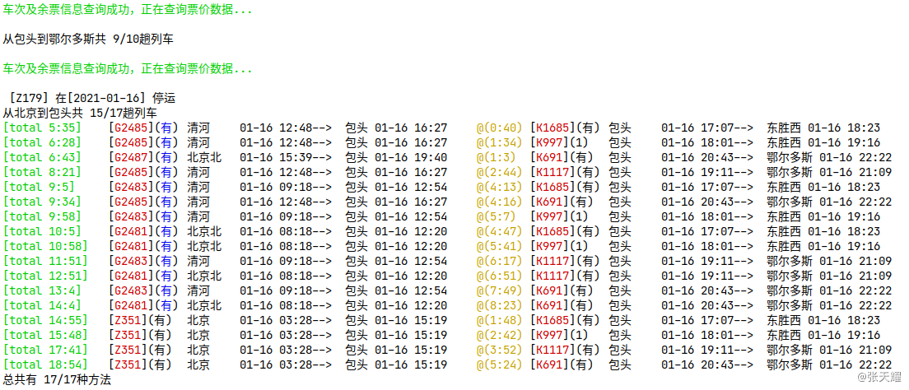

# train-tickets-cli
基于 Python 3.x 的命令行版 12306 火车票查询器

### 安装依赖包
#### Windows
```
pip install -r requirements.txt
```
#### macOS / Linux
```
pip3 install -r requirements.txt
```

### 使用方式
#### Windows
```
python src/app.py <from_city> <dest_city> [<date>] [-g][-c][-d][-k][-t][-z][-l]
```
#### macOS / Linux
```
python3 src/app.py <from_city> <dest_city> [<date>] [-g][-c][-d][-k][-t][-z][-l]
```
### 参数说明
```
from_city - 出发城市，支持拼音输入，例如：成都/chengdu
dest_city - 到达城市，支持拼音输入，例如：重庆/chongqing
date - 乘车日期，格式要求为YYYY-mm-dd，例如：2019-10-24（可选参数，若不传则默认查询当天）
```

### 选项说明
```
-g 查询高铁
-c 查询城际
-d 查询动车
-k 查询普快
-t 查询特快
-z 查询直达
-l 查询临客
```
上述所有选项均可对数据进行混合筛选，例如：-g 将只查询所有高铁车次，-gd 则是查询所有的高铁和动车车次，其它选项也以此类推。如果不输入任何选项参数，则查询所有车次的数据。

### 使用举例
#### Windows
```
python src/app.py 成都 重庆 -gdz
python src/app.py chengdu chongqing -gdz

python src/app.py 成都 重庆 2019-11-11 -gdz
python src/app.py chengdu chongqing 2019-11-11 -gdz
```
#### macOS / Linux
```
python3 src/app.py 成都 重庆 -gdz
python3 src/app.py chengdu chongqing -gdz

python3 src/app.py 成都 重庆 2019-11-11 -gdz
python3 src/app.py chengdu chongqing 2019-11-11 -gdz
```

### 演示效果
显示中转策略搜索结果
```angular2html
app = TrainTicketsFinder()
    # app.query_satisfied_trains_info()
app.change("北京","呼和浩特东","鄂尔多斯","2021-01-16")
```

